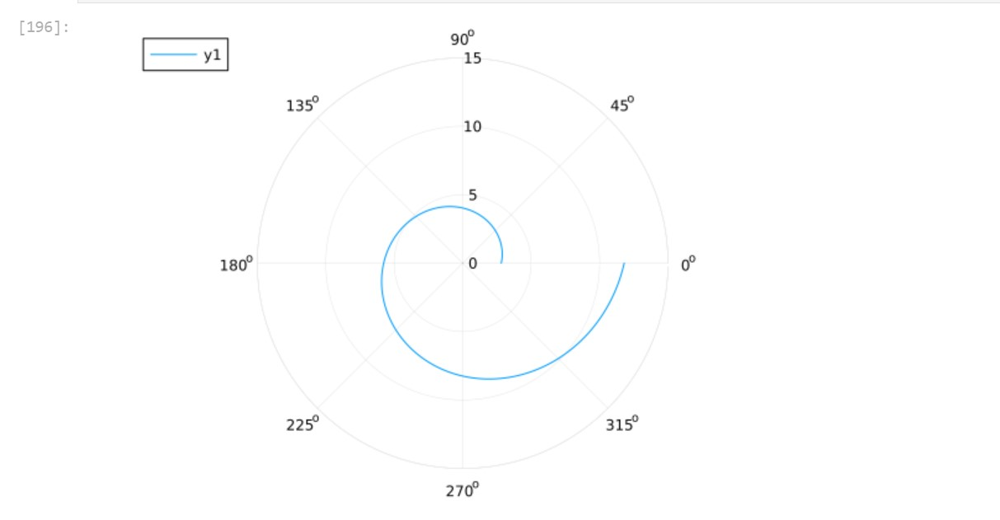
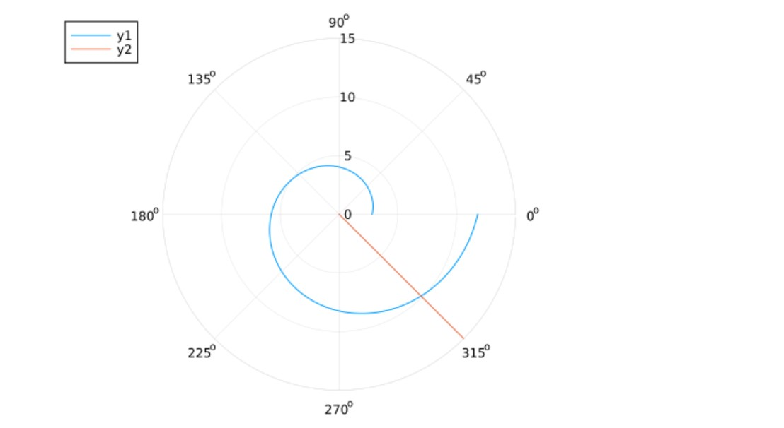
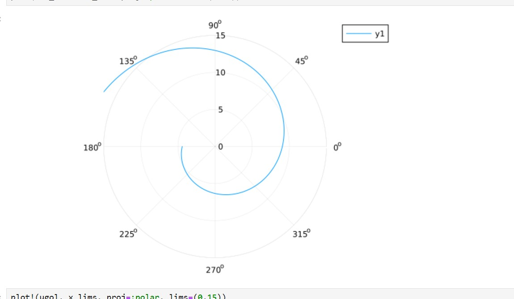
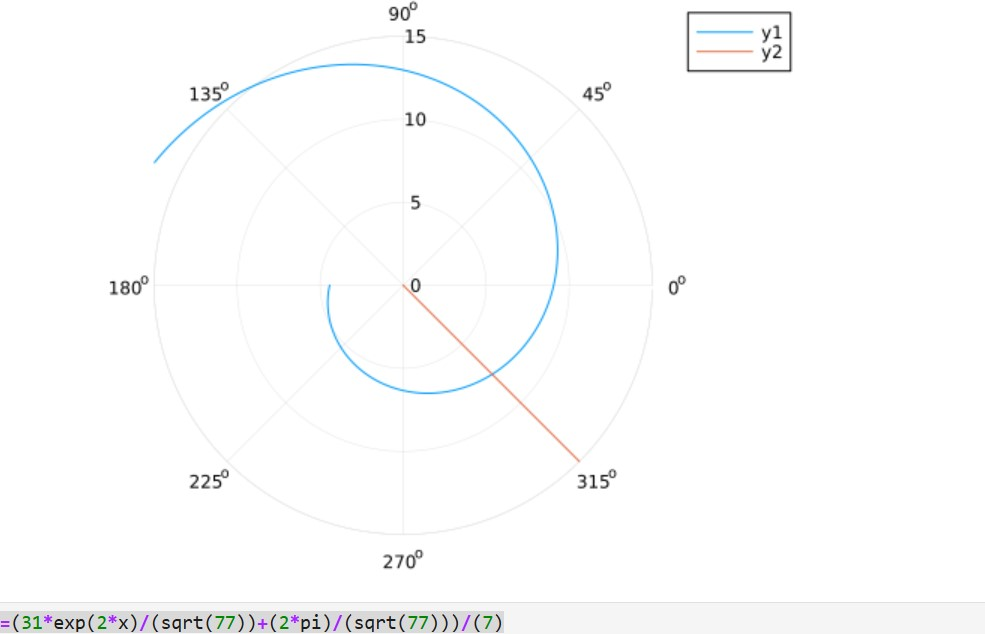

---
## Author
author:
  name: Сингх Ааруши
  degrees: DSc
  orcid: 0000-0002-0877-7063
  email: 1132215095@rudn.ru
  affiliation:
    - name: Российский университет дружбы народов
      country: Российская Федерация
      postal-code: 117198
      city: Москва
      address: ул. Миклухо-Маклая, д. 6

## Title
title: "Шаблон отчёта по лабораторной работе №2"
subtitle: "вариант 26"
license: "CC BY"
---

# Цель работы

Построить математическую модель для выбора правильной стратегии при решении примера задаче о погоне.

# Задание

На море в тумане катер береговой охраны преследует лодку браконьеров. Через определенный промежуток времени туман рассеивается, и лодка обнаруживается на расстоянии 15.5 км от катера. 
Затем лодка снова скрывается в тумане и уходит прямолинейно в неизвестном направлении. 
Известно, что скорость катера в 4,5 раза больше скорости браконьерской лодки. 

1. Записать уравнение, описывающее движение катера, с начальными условиями для двух случаев (в зависимости от расположения катера относительно лодки в начальный момент времени). 

2. Построить траекторию движения катера и лодки для двух случаев. 

3. Найти точку пересечения траектории катера и лодки

# Теоретическое введение

Кривая погони — кривая, представляющая собой решение задачи о «погоне», которая ставится следующим образом. 
Пусть точка A равномерно движется по некоторой заданной кривой. 
Требуется найти траекторию равномерного движения точки P такую, что касательная, проведённая к траектории в любой момент движения, проходила бы через соответствующее этому моменту положение точки A [1]. 

# Выполнение лабораторной работы

Формула для выбора варианта: (1132215095%70)+1 = 26 вариант. 
Запишем уравнение описывающее движение катера, с начальными условиями для двух случаев (в зависимости от расположения катера относительно лодки в начальный момент времени). 
Принимем за 𝑡0 = 0, 𝑥0 = 0 – место нахождения лодки браконьеров в момент обнаружения,𝑥𝑘0 = 𝑘 - место нахождения катера береговой охраны относительно лодки браконьеров в момент обнаружения лодки. 
Введем полярные координаты. Считаем, что полюс - это точка обнаружения лодки браконьеров 𝑥𝑘0 (𝜃 = 𝑥𝑘0 = 0), а полярная ось 𝑟 проходит через точку нахождения катера береговой охраны. 
Траектория катера должна быть такой, чтобы и катер, и лодка все время были на одном расстоянии от полюса 𝜃 , только в этом случае траектория катера пересечется с траекторией лодки. 
Поэтому для начала катер береговой охраны должен двигаться некоторое время прямолинейно, пока не окажется на том же расстоянии от полюса, что и лодка браконьеров. После этого катер береговой охраны должен двигаться вокруг полюса удаляясь от него с той же скоростью, что и лодка браконьеров. 
Чтобы найти расстояние 𝑥 (расстояние после которого катер начнет двигаться вокруг полюса), необходимо составить простое уравнение. Пусть через время 𝑡 катер и лодка окажутся на одном расстоянииx от полюса. За это время лодка пройдет 𝑥 , а катер 𝑘 − 𝑥 (или 𝑘 + 𝑥, в зависимости от начального положения катера относительно полюса). 
Время, за которое они пройдут это расстояние, 7 вычисляется как 𝑥 𝑣 или 𝑘 − 𝑥 /4.5𝑣 (во втором случае 𝑘 + 𝑥/ 4.5𝑣 ). Так как время одно и то же, то эти величины одинаковы. Тогда неизвестное расстояниеx можно найти из следующего уравнения: 𝑥 𝑣 = 𝑘 − 𝑥 /4.5𝑣 – в первом случае 𝑥 𝑣 = 𝑘 + 𝑥 4.1𝑣 – во втором Отсюда мы найдем два значения 𝑥1 = 15.5/5.5, 1 и 𝑥2 = 15.5/3.5 , задачу будем решать для двух случаев. 
После того, как катер береговой охраны окажется на одном расстоянии от полюса, что и лодка, он должен сменить прямолинейную траекторию и начать двигаться вокруг полюса удаляясь от него со скоростью лодки 𝑣. Для этого скорость катера раскладываем на две составляющие: 𝑣𝑟 - радиальная скорость и - 𝑣𝜏 тангенциальная скорость. Радиальная скорость - это скорость, с которой катер удаляется от полюса, 𝑣𝑟 = 𝑑𝑟/𝑑𝑡. Нам нужно, чтобы эта скорость была равна скорости лодки, поэтому полагаем 𝑑𝑟 𝑑𝑡 = 𝑣. 
Тангенциальная скорость – это линейная скорость вращения катера относительно полюса. Она равна произведению угловой скорости 𝑑𝜃/𝑑𝑡 на радиус 𝑟, 𝑟 𝑑𝜃/𝑑t
Получаем: 𝑣𝜏 = √ 20.25𝑣^2 − 𝑣^2 = √ 19.25𝑣 Из чего можно вывести: 𝑟 𝑑𝜃/𝑑𝑡 = √ 19.25𝑣 Решение исходной задачи сводится к решению системы из двух дифференциальных уравнений:

𝑑𝑟/𝑑𝑡 = 𝑣   
𝑟 𝑑𝜃/𝑑𝑡 = √19.25 𝑣
С начальными условиями для первого случая:  𝜃0 = 0,
 𝑟0 = 15.5/5.51 (1) Или для второго:  𝜃0 = −𝜋 
𝑟0 = 15.5/3.5 (2) 
Исключая из полученной системы производную по 𝑡, можно перейти к следующему уравнению: 𝑑𝑟 𝑑𝜃 = 𝑟 /√ 19.25 
Начальные условия остаются прежними. Решив это уравнение, мы получим траекторию движения катера в полярных координата

Построение модели 

using DifferentialEquations, Plots 

# расстояние от лодки до катера 

k = 15.5

# начальные условия для 1 и 2 случаев

r0 = k/5.5
 r0_2 = k/3.5 
theta0 = (0.0, 2*pi) t
heta0_2 = (-pi, pi) 
# данные для движения лодки браконьеров 
fi = 3*pi/4; t = (0, 50); 
# функция, описывающая движение лодки браконьеров 
x(t) = tan(fi)*t; 
# функция, описывающая движение катера береговой охраны 
f(r, p, t) = r/sqrt(19.25) 
# постановка проблемы и решение ДУ для 1 случая 
prob = ODEProblem(f, r0, theta0) 
sol = solve(prob, saveat = 0.01) 
# отрисовка траектории движения катера 

plot(sol.t, sol.u, proj=:polar, lims=(0, 15)
В результате получаем

{#fig-001 width=70%}

## необходимые действия для построения траектории движения лодки 
ugol = [fi for i in range(0,15)] 

x_lims = [x(i) for i in range(0,15)] 
# отрисовка траектории движения лодки вместе с катером 

plot!(ugol, x_lims, proj=:polar, lims=(0, 15))

В результате получаем

{#fig-001 width=70%}

# точное решение ДУ, описывающего движение катера береговой охраны 

y(x)=(31*exp((2*x)/sqrt(77)))/11 

# подставим в точное решение угол, под которым движется лодка браконьеров 
y(fi) 

# точка пересечения лодки и катера для 1 случая 

4.82166110552093
 

Теперь перейдем к решению в случае 2. 

# постановка проблемы и решение ДУ для 2 случая

prob_2 = ODEProblem(f, r0_2, theta0_2) 
sol_2 = solve(prob_2, saveat = 0.01) 

# отрисовка траектории движения катера 

plot(sol_2.t, sol_2.u, proj=:polar, lims=(0,15)

{#fig-001 width=70%}

# отрисовка траектории движения лодки вместе с катером 

plot!(ugol, x_lims, proj=:polar, lims=(0, 15))

# точное решение ДУ, описывающего движение катера береговой охраны для 2 случая 

y2(x)=(31*exp(2*x)/(sqrt(77))+(2*pi)/(sqrt(77)))/(7)

{#fig-001 width=70%}

# подставим в точное решение угол, под которым движется лодка браконьеров 
y2(fi-pi) 
# точка пересечения лодки и катера для 2 случая

0.20720396951679648

# Выводы

В процессе выполнения данной лабораторной работы я построила математическую модель для выбора правильной стратегии при решении примера задаче о погоне.

# Список литературы{.unnumbered}
1. Кривая погони [Электронный ресурс]. URL: https://ru.wikipedia.org/wiki/ Кривая_погони. 

::: {#refs}
:::
