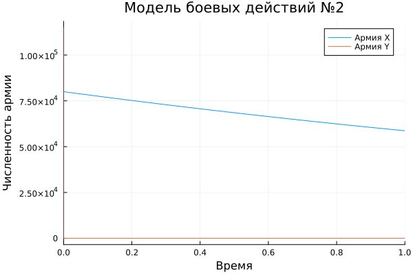

---
## Author
author:
  name: Сингх Ааруши
  degrees: DSc
  orcid: 0000-0002-0877-7063
  email: 1132215095@rudn.ru
  affiliation:
    - name: Российский университет дружбы народов
      country: Российская Федерация
      postal-code: 117198
      city: Москва
      address: ул. Миклухо-Маклая, д. 6
## Title
title: Презентация по лабораторной работе №3
subtitle: Модель боевых действий вариант 26
license: CC BY
date: 19.03.2026
date-format: "2026-03-19" 
---

# Информация

## Докладчик

:::::::::::::: {.columns align=center}
::: {.column width="70%"}

  * Сингх Ааруши
  * студентка
  * Российский университет дружбы народов
  * [1132215095@pfur.ru](mailto:1132215095@pfur.ru)
  * <https://github.com/Saarushi03/study_2025_2026_mathmod>

:::
::: {.column width="30%"}


:::
::::::::::::::

## Цель работы

Построить модель боевых действий на языке программирования Julia.

# Задание

Построить графики изменения численности войск армии $X$ и армии $Y$ для  следующих случаев:

1. Модель боевых действий между регулярными войсками

2. Модель ведение боевых действий с участием регулярных войск и партизанских отрядов

# Выполнение лабораторной работы

## Модель боевых действий между регулярными войсками

$$\begin{cases}
    \dfrac{dx}{dt} = -0.3x(t)- 0.56y(t)+sin(t + 10)\\
    \dfrac{dy}{dt} = -0.68x(t)- 0.33y(t)+cos(t+ 10)
\end{cases}$$

## Модель боевых действий между регулярными войсками

```Julia
function reg(u, p, t)
    x, y = u
    a, b, c, h = p
    dx = -a*x - b*y+sin(t + 10)
    dy = -c*x -h*y+cos(t + 10)
    return [dx, dy]
end
```
## Модель боевых действий между регулярными войсками

```Julia
u0 = [80000, 115000]
p = [0.3, 0.56, 0.68, 0.33]
tspan = (0,1)
end
```

## Модель боевых действий между регулярными войсками

```Julia
prob = ODEProblem(reg, u0, tspan, p)
sol = solve(prob, Tsit5())
plot(sol, title = "Модель боевых действий №1",  label = ["Армия X" "Армия Y"], xaxis = "Время", yaxis = "Численность армии")
```

## Модель боевых действий между регулярными войсками

{#fig:001 width=70%}

## Модель ведение боевых действий с участием регулярных войск и партизанских отрядов

$$\begin{cases}
    \dfrac{dx}{dt} = -0.31x(t)-0.77y(t)+sin(2t + 10)\\
    \dfrac{dy}{dt} = -0.67x(t)y(t)-0.51y(t)+cos(t + 10)
\end{cases}$$

## Модель ведение боевых действий с участием регулярных войск и партизанских отрядов

```Julia
function reg_part(u, p, t)
    x, y = u
    a, b, c, h = p
    dx = -a*x - b*y+sin(2t + 10)
    dy = -c*x*y -h*y+cos(t + 10)
    return [dx, dy]
end
```
## Модель ведение боевых действий с участием регулярных войск и партизанских отрядов

```Julia
u0 = [80000, 115000]
p = [0.31, 0.77, 0.67, 0.51]
tspan = (0,1)\
end
```
## Модель ведение боевых действий с участием регулярных войск и партизанских отрядов

```Julia
prob2 = ODEProblem(reg_part, u0, tspan, p)
sol2 = solve(prob2, Tsit5())
plot(sol2, title = "Модель боевых действий №2", label = ["Армия X" "Армия Y"], xaxis = "Время", yaxis = "Численность армии")
```
## Модель ведение боевых действий с участием регулярных войск и партизанских отрядов


{#fig:002 width=70%}

# Выводы

В процессе выполнения данной лабораторной работы я построила модель боевых действий на языке программирования Julia, а также провела сравнительный анализ.


# Список литературы{.unnumbered}

1. Законы_Осипова_—_Ланчестера [Электронный ресурс]. URL: https://ru.wikipedia.org/wiki/Законы_Осипова_—_Ланчестера.

::: {#refs}
:::
