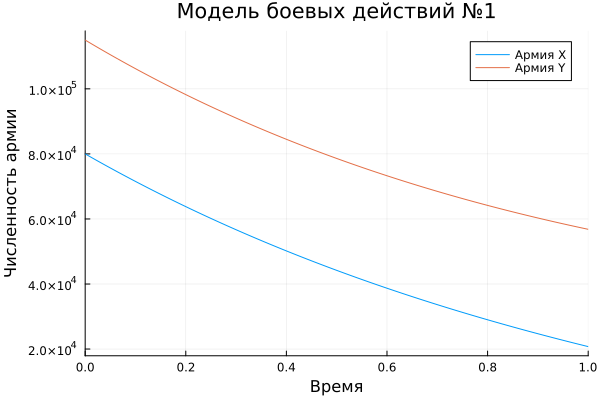

---
## Author
author:
  name: Сингх Ааруши
  degrees: DSc
  orcid: 0000-0002-0877-7063
  email: 1132215095@rudn.ru
  affiliation:
    - name: Российский университет дружбы народов
      country: Российская Федерация
      postal-code: 117198
      city: Москва
      address: ул. Миклухо-Маклая, д. 6

## Title
title: "Шаблон отчёта по лабораторной работе №3"
subtitle: "Модель боевых действий вариант 26"
license: "CC BY"
---

# Цель работы

Построить модель боевых действий на языке программирования Julia.

# Задание

Между страной $X$ и страной $Y$ идет война. Численность состава войск
исчисляется от начала войны, и являются временными функциями $x(t)$ и $y(t)$. 
В начальный момент времени страна $X$ имеет армию численностью 80 000 человек,
а в распоряжении страны $Y$ армия численностью в 115 000 человек. 
Для упрощения модели считаем, что коэффициенты $a, b, c, h$ постоянны. 
Также считаем $P(t)$ и $Q(t)$ непрерывные функции.

Построить графики изменения численности войск армии $X$ и армии $Y$ для  следующих случаев:

1. Модель боевых действий между регулярными войсками
$$\begin{cases}
    \dfrac{dx}{dt} = -0.3x(t)- 0.56y(t)+sin(t + 10)\\
    \dfrac{dy}{dt} = -0.68x(t)- 0.33y(t)+cos(t+ 10)
\end{cases}$$

2. Модель ведение боевых действий с участием регулярных войск и партизанских отрядов

$$\begin{cases}
    \dfrac{dx}{dt} = -0.31x(t)-0.77y(t)+sin(2t + 10)\\
    \dfrac{dy}{dt} = -0.67x(t)y(t)-0.51y(t)+cos(t + 10)
\end{cases}$$


# Теоретическое введение

Законы Ланчестера (законы Осипова — Ланчестера) — математическая формула для расчета относительных сил пары сражающихся сторон — подразделений вооруженных сил. 
В статье «Влияние численности сражающихся сторон на их потери», опубликованной журналом «Военный сборник» в 1915 году, генерал-майор Корпуса военных топографов М. П. Осипов описал математическую модель глобального вооружённого противостояния, практически применяемую в военном деле при описании убыли сражающихся сторон с течением времени и, входящую в математическую теорию исследования операций, на год опередив английского математика Ф. У. Ланчестера. 
Мировая война, две революции в России не позволили новой власти заявить в установленном в научной среде порядке об открытии царского офицера.

Уравнения Ланчестера — это дифференциальные уравнения, описывающие зависимость между силами сражающихся сторон A и D как функцию от времени, причем функция зависит только от A и D.

В 1916 году, в разгар первой мировой войны, Фредерик Ланчестер разработал систему дифференциальных уравнений для демонстрации соотношения между противостоящими силами. Среди них есть так называемые Линейные законы Ланчестера (первого рода или честного боя, для рукопашного боя или неприцельного огня) и Квадратичные законы Ланчестера (для войн начиная с XX века с применением прицельного огня, дальнобойных орудий, огнестрельного оружия). 
В связи с установленным приоритетом в англоязычной литературе наметилась тенденция перехода от фразы «модель Ланчестера» к «модели Осипова — Ланчестера» [@wiki:bash].


# Выполнение лабораторной работы

## Модель боевых действий между регулярными войсками

$$\begin{cases}
    \dfrac{dx}{dt} = -0.3x(t)- 0.56y(t)+sin(t + 10)\\
    \dfrac{dy}{dt} = -0.68x(t)- 0.33y(t)+cos(t+ 10)
\end{cases}$$


Потери, не связанные с боевыми действиями, описывают члены $-0.3x(t)$ и $-0.56y(t)$ 
(коэффиценты при $x$ и $y$ - это величины, характеризующие степень влияния различных факторов на потери), члены $-0.68y(t)$ и $-0.33x(t)$ отражают потери на поле боя 
(коэффиценты при  $x$ и $y$ указывают на эффективность боевых действий со стороны у и х соответственно). 
Функции P(t) = sin(t + 10), Q(t) = cos(t + 10) учитывают возможность подхода подкрепления к войскам Х и У в течение одного дня.

Для начала построим эту модель на Julia:


```Julia

# используемые библиотеки
using DifferentialEquations, Plots;

# задание системы дифференциальных уравнений, описывающих модель 
# боевых действий между регулярными войсками
function reg(u, p, t)
    x, y = u
    a, b, c, h = p
    dx = -a*x - b*y+sin(t + 10)
    dy = -c*x -h*y+cos(t + 10)
    return [dx, dy]
end

# начальные условия
u0 = [80000, 115000]
p = [0.3, 0.56, 0.68, 0.33]
tspan = (0,1)

# постановка проблемы
prob = ODEProblem(reg, u0, tspan, p)

# решение системы ДУ
sol = solve(prob, Tsit5())

# построение графика, который описывает изменение численности армий
plot(sol, title = "Модель боевых действий №1",  label = ["Армия X" "Армия Y"], xaxis = "Время", yaxis = "Численность армии")
```

В результате получаем следующий график (рис. [-@fig:001]):

{#fig:001 width=70%}

На первом графике видно, что обе армии со временем несут потери. 
Армия X изначально больше по численности, поэтому в начале она выглядит устойчивее. 
Но армия Y тоже оказывает сильное влияние на противника, поэтому численность армии X заметно уменьшается. 
В целом график показывает взаимные большие потери с обеих сторон 

## Модель ведение боевых действий с участием регулярных войск и партизанских отрядов

Во втором случае в борьбу добавляются партизанские отряды. Нерегулярные
войска в отличии от постоянной армии менее уязвимы, так как действуют скрытно,
в этом случае сопернику приходится действовать неизбирательно, по площадям,
занимаемым партизанами. Поэтому считается, что тем потерь партизан,
проводящих свои операции в разных местах на некоторой известной территории,
пропорционален не только численности армейских соединений, но и численности
самих партизан. В результате модель принимает вид:

$$\begin{cases}
    \dfrac{dx}{dt} = -0.31x(t)-0.77y(t)+sin(2t + 10)\\
    \dfrac{dy}{dt} = -0.67x(t)y(t)-0.51y(t)+cos(t + 10)
\end{cases}$$

В этой системе все величины имею тот же смысл, что и в первой модели.

Построим модель на Julia:

```Julia

# задание системы дифференциальных уравнений, описывающих модель 
# боевых действий с участием регулярных войск и партизанских отрядов
function reg_part(u, p, t)
    x, y = u
    a, b, c, h = p
    dx = -a*x - b*y+sin(2t + 10)
    dy = -c*x*y -h*y+cos(t + 10)
    return [dx, dy]
end

# начальные условия
u0 = [80000, 115000]
p = [0.31, 0.77, 0.67, 0.51]
tspan = (0,1)\

# постановка проблемы
prob2 = ODEProblem(reg_part, u0, tspan, p)

# решение системы ДУ
sol2 = solve(prob2, Tsit5())

# построение графика, который описывает изменение численности армий
plot(sol2, title = "Модель боевых действий №2", label = ["Армия X" "Армия Y"], xaxis = "Время", yaxis = "Численность армии")
```

В результате получаем слудющий график изменения численности армий (рис. [-@fig:002]):

{#fig:002 width=70%}

На втором графике обе армии тоже уменьшаются по численности, но здесь потери могут происходить быстрее, чем в первой модели. 
Это связано с тем, что во второй системе учитываются дополнительные факторы, включая более сложное воздействие на армию Y. 
Поэтому график показывает более напряжённый сценарий боя, где численность сторон снижается более резко.


# Выводы

В процессе выполнения данной лабораторной работы я построила модель боевых действий на языке программирования Julia, а также провела сравнительный анализ.


# Список литературы{.unnumbered}

::: {#refs}
:::
