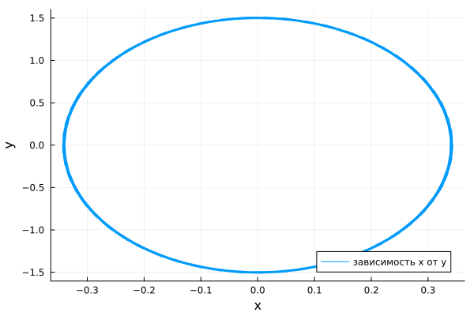
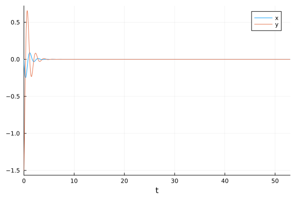
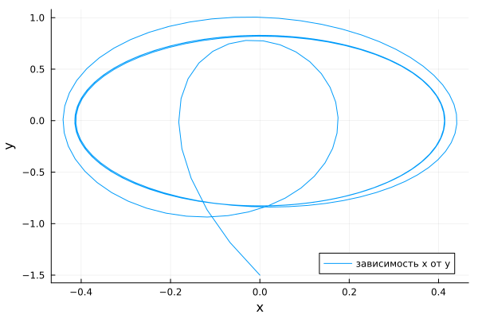

---
## Author
author:
  name: Сингх Ааруши
  degrees: DSc
  orcid: 0000-0002-0877-7063
  email: 1132215095@rudn.ru
  affiliation:
    - name: Российский университет дружбы народов
      country: Российская Федерация
      postal-code: 117198
      city: Москва
      address: ул. Миклухо-Маклая, д. 6
## Title
title: Лабораторная работа №4
subtitle: Модель гармонических колебаний вариант 26
license: CC BY
date: 2026-04-04
date-format: "2026-04-04" 
---

# Информация

## Докладчик

:::::::::::::: {.columns align=center}
::: {.column width="70%"}

  * Сингх Ааруши
  * Студентка
  * Российский университет дружбы народов им. П. Лумумбы
  * [1132215095@rudn.ru](mailto:1132215095@rudn.ru)
  * <https://github.com/Saarushi03/study_2025_2026_mathmod>

:::
::: {.column width="30%"}


:::
::::::::::::::

# Цель работы

Построить математическую модель гармонического осциллятора.

# Задание

Построить фазовый портрет гармонического осциллятора и решение уравнения
гармонического осциллятора для следующих случаев:

1. Колебания гармонического осциллятора без затуханий и без действий внешней
силы
 $$\ddot{x} +4.4x = 0,$$

2. Колебания гармонического осциллятора c затуханием и без действий внешней силы 
  
  $$\ddot x + 2.5 \dot x + 4 x = 0,$$

3. Колебания гармонического осциллятора c затуханием и под действием внешней силы 
   
   $$\ddot x + 2 \dot x + 3.3 x = 3.3 cos(2t).$$
На интервале $t \in [0; 53]$ (шаг 0.05) с начальными условиями $x_0 = 0, \,\, y_0=-1.5.$

# Выполнение лабораторной работы

## Модель колебаний гармонического осциллятора без затуханий и без действий внешней силы

```Julia

# Используемые библиотеки
using DifferentialEquations, Plots;

# Начальные условия
tspan = (0,53)
u0 = [0, -1.5]
p1 = [0, 4.4]

## Модель колебаний гармонического осциллятора без затуханий и без действий внешней силы

```Julia
# Задание функции
function f1(u, p, t)
    x, y = u
    g, w = p
    dx = y
    dy = -g .*y - w^2 .*x
    return [dx, dy]
end
# Постановка проблемы и ее решение
problem1 = ODEProblem(f1, u0, tspan, p1)
sol1 = solve(problem1, Tsit5(), saveat = 0.05)
```

## Модель колебаний гармонического осциллятора без затуханий и без действий внешней силы

{#fig:001 width=70%}

## Модель колебаний гармонического осциллятора без затуханий и без действий внешней силы 

{#fig:002 width=70%}


## Модель колебаний гармонического осциллятора c затуханием и без действий внешней силы 

```Julia
# Начальные условия
tspan = (0, 53)
u0 = [0, -1.5]
p2 = [2.5, 4]

## Модель колебаний гармонического осциллятора c затуханием и без действий внешней силы 

```Julia
# Задание функции
function f1(u, p, t)
    x, y = u
    g, w = p
    dx = y
    dy = -g .*y - w^2 .*x
    return [dx, dy]
end
# Постановка проблемы и ее решение
problem2 = ODEProblem(f1, u0, tspan, p2)
sol2 = solve(problem2, Tsit5(), saveat = 0.05)
```

## Модель колебаний гармонического осциллятора c затуханием и без действий внешней силы 

{#fig:005 width=70%}

## Модель колебаний гармонического осциллятора c затуханием и без действий внешней силы 

{#fig:006 width=70%}

## Модель колебаний гармонического осциллятора c затуханием и под действием внешней силы


```Julia
# Начальные условия
tspan = (0,53)
u0 = [0, -1.5]
p3 = [2, 3.3]
# Функция, описывающая внешние силы, действующие на осциллятор
f(t) = 3.3*cos(2*t)

```Julia
# Задание функции
function f2(u, p, t)
    x, y = u
    g, w = p
    dx = y
    dy = -g .*y - w^2 .*x .+f(t)
    return [dx, dy]
end
# Постановка проблемы и ее решение
problem3 = ODEProblem(f2, u0, tspan, p3)
sol3 = solve(problem3, Tsit5(), saveat = 0.05)
```

## Модель колебаний гармонического осциллятора c затуханием и под действием внешней силы

{#fig:009 width=70%}

## Модель колебаний гармонического осциллятора c затуханием и под действием внешней силы

{#fig:010 width=70%}

# Выводы

В процессе выполнения данной лабораторной работы я построила математическую модель гармонического осциллятора.


# Список литературы{.unnumbered}
1. Гармонические колебания [Электронный ресурс]. URL: https://ru.wikipedia.org/wiki/Гармонические_колебания.

::: {#refs}
:::
