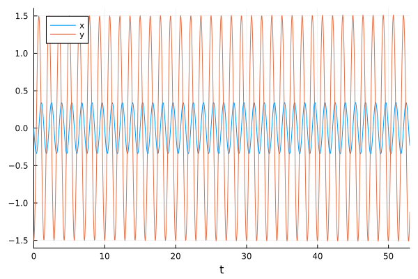
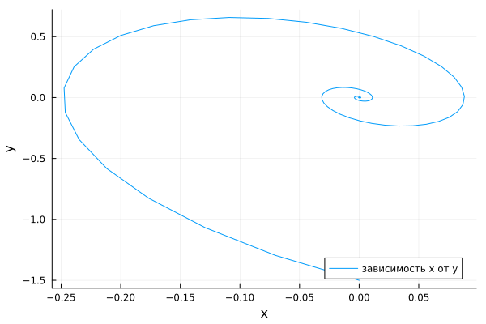
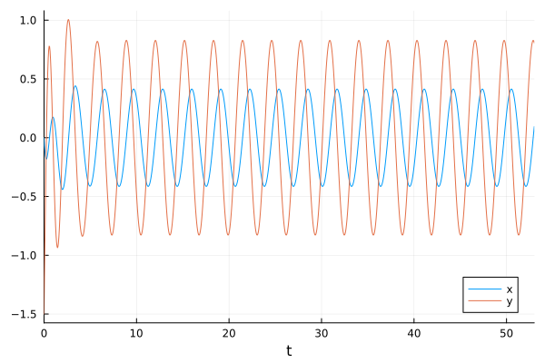

---
## Author
author:
  name: Сингх Ааруши
  degrees: DSc
  orcid: 0000-0002-0877-7063
  email: 1132215095@rudn.ru
  affiliation:
    - name: Российский университет дружбы народов
      country: Российская Федерация
      postal-code: 117198
      city: Москва
      address: ул. Миклухо-Маклая, д. 6

## Title
title: "Шаблон отчёта по лабораторной работе №4"
subtitle: "Модель гармонических колебаний вариант 26 "
license: "CC BY"
---

# Цель работы

Построить математическую модель гармонического осциллятора.


# Задание

Построить фазовый портрет гармонического осциллятора и решение уравнения
гармонического осциллятора для следующих случаев:

1. Колебания гармонического осциллятора без затуханий и без действий внешней
силы
 $$\ddot{x} +4.4x = 0,$$

2. Колебания гармонического осциллятора c затуханием и без действий внешней силы 
  
  $$\ddot x + 2.5 \dot x + 4 x = 0,$$

3. Колебания гармонического осциллятора c затуханием и под действием внешней силы 
   
   $$\ddot x + 2 \dot x + 3.3 x = 3.3 cos(2t).$$
На интервале $t \in [0; 53]$ (шаг 0.05) с начальными условиями $x_0 = 0, \,\, y_0=-1.5.$


# Теоретическое введение

Гармонические колебания — колебания, при которых физическая величина изменяется с течением времени по гармоническому (синусоидальному, косинусоидальному) закону.

Уравнение гармонического колебания имеет вид

$$x(t)=A\sin(\omega t+\varphi _{0})$$

или

$$x(t)=A\cos(\omega t+\varphi _{0}),$$ 

где $x$ — отклонение колеблющейся величины в текущий момент времени $t$ от среднего за период значения (например, в кинематике — смещение, отклонение колеблющейся точки от положения равновесия);
$A$ — амплитуда колебания, то есть максимальное за период отклонение колеблющейся величины от среднего за период значения, размерность 
$A$ совпадает с размерностью $x$;
$\omega$ (радиан/с, градус/с) — циклическая частота, показывающая, на сколько радиан (градусов) изменяется фаза колебания за 1 с;

$(\omega t+\varphi _{0})=\varphi$ (радиан, градус) — полная фаза колебания (сокращённо — фаза, не путать с начальной фазой);

$\varphi _{0}$ (радиан, градус) — начальная фаза колебаний, которая определяет значение полной фазы колебания (и самой величины $x$) в момент времени $t=0$.
Дифференциальное уравнение, описывающее гармонические колебания, имеет вид

$$\frac {d^{2}x}{dt^{2}}+\omega ^{2}x=0.$$

[@wiki_bash].


# Выполнение лабораторной работы

## Модель колебаний гармонического осциллятора без затуханий и без действий внешней силы


```Julia

# Используемые библиотеки
using DifferentialEquations, Plots;

# Начальные условия
tspan = (0,53)
u0 = [0, -1.5]
p1 = [0, 4.4]

# Задание функции
function f1(u, p, t)
    x, y = u
    g, w = p
    dx = y
    dy = -g .*y - w^2 .*x
    return [dx, dy]
end

# Постановка проблемы и ее решение
problem1 = ODEProblem(f1, u0, tspan, p1)
sol1 = solve(problem1, Tsit5(), saveat = 0.05)
```

В результате получаем следующие графики решения уравнения
гармонического осциллятора  (рис. [-@fig:001]) и его фазового портрета  (рис. [-@fig:002]).

{#fig:001 width=70%}

{#fig:002 width=70%}

В первом случае коэффициент затухания равен нулю.


## Модель колебаний гармонического осциллятора c затуханием и без действий внешней силы 

Реализуем эту модель на языке программирования Julia. 

```Julia

# Используемые библиотеки
using DifferentialEquations, Plots;

# Начальные условия
tspan = (0, 53)
u0 = [0, -1.5]
p2 = [2.5, 4]

# Задание функции
function f1(u, p, t)
    x, y = u
    g, w = p
    dx = y
    dy = -g .*y - w^2 .*x
    return [dx, dy]
end

# Постановка проблемы и ее решение
problem2 = ODEProblem(f1, u0, tspan, p2)
sol2 = solve(problem2, Tsit5(), saveat = 0.05)
```

В результате получаем следующие графики решения уравнения
гармонического осциллятора  (рис. [-@fig:005]) и его фазового портрета  (рис. [-@fig:006]).

{#fig:005 width=70%}

{#fig:006 width=70%}

В этом случае сначала происходят колебания осциллятора, а затем график затухает, поскольку у нас есть параметр, отвечающий за потери энергии.


## Модель колебаний гармонического осциллятора c затуханием и под действием внешней силы

Реализуем эту модель на языке программирования Julia. 

```Julia

# Используемые библиотеки
using DifferentialEquations, Plots;

# Начальные условия
tspan = (0,53)
u0 = [0, -1.5]
p3 = [2, 3.3]

# Функция, описывающая внешние силы, действующие на осциллятор
f(t) = 3.3*cos(2*t)

# Задание функции
function f2(u, p, t)
    x, y = u
    g, w = p
    dx = y
    dy = -g .*y - w^2 .*x .+f(t)
    return [dx, dy]
end

# Постановка проблемы и ее решение
problem3 = ODEProblem(f2, u0, tspan, p3)
sol3 = solve(problem3, Tsit5(), saveat = 0.05)
```

В результате получаем следующие графики решения уравнения
гармонического осциллятора  (рис. [-@fig:009]) и его фазового портрета  (рис. [-@fig:010]).

{#fig:009 width=70%}

{#fig:010 width=70%}

В третьем случае есть и затухание, и внешняя сила.

В результате можно сделать вывод:
без затухания — колебания бесконечны
с затуханием — система останавливается
с внешней силой — возникают устойчивые колебания 

# Выводы

В процессе выполнения данной лабораторной работы я построила математическую модель гармонического осциллятора.


# Список литературы{.unnumbered}

::: {#refs}
:::
