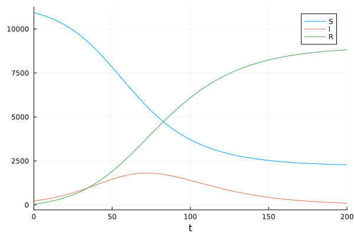
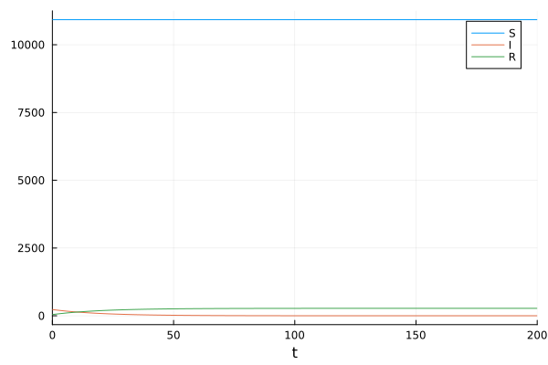

---
## Author
author:
  name: Сингх Ааруши
  degrees: DSc
  orcid: 0000-0002-0877-7063
  email: 1132215095@rudn.ru
  affiliation:
    - name: Российский университет дружбы народов
      country: Российская Федерация
      postal-code: 117198
      city: Москва
      address: ул. Миклухо-Маклая, д. 6
## Title
title: Лабораторная работа №6
subtitle: Задача об эпидемии
license: CC BY
date: 01-05-2026
date-format: "2026-05-01" 
---

# Информация

## Докладчик

:::::::::::::: {.columns align=center}
::: {.column width="70%"}

  * Сингх Ааруши
  * студентка
  * Российский университет дружбы народов им. П. Лумумбы
  * [1132215095@rudn.ru](mailto:1132215095@rudn.ru)
  * <https://github.com/Saarushi03/study_2025_2026_mathmod>

:::


::::::::::::::

## Цель работы

Исследовать модель SIR (задача об эпидемии)

## Задание

На одном острове вспыхнула эпидемия. Известно, что из всех проживающих
на острове ($N=11200$) в момент начала эпидемии ($t=0$) число заболевших людей
(являющихся распространителями инфекции) $I(0)=230$, А число здоровых людей с
иммунитетом к болезни $R(0)=45$. Таким образом, число людей восприимчивых к
болезни, но пока здоровых, в начальный момент времени $S(0)=N-I(0)- R(0)$.

Постройте графики изменения числа особей в каждой из трех групп.

Рассмотрите, как будет протекать эпидемия в случае:

1) если $I(0)\leq I^*$;

2) если $I(0) > I^*$.

# Случай $I(0)\leq I^*$

## Реализация на Julia

```Julia

function sir_2(u,p,t)
    (S,I,R) = u
    (b, c) = p
    N = S+I+R
    dS = 0
    dI = -c*I
    dR = c*I
    return [dS, dI, dR]
end
```

## Реализация на Julia

``` Julia
N = 11200
I_0 = 230
R_0 = 45
S_0 = N - I_0 - R_0
u0 = [S_0, I_0, R_0]
p = [0.1, 0.05]
tspan = (0.0, 200.0)
```

## Реализация на Julia

```Julia
prob_2 = ODEProblem(sir_2, u0, tspan, p)
sol_2 = solve(prob_2, Tsit5(), saveat = 0.1)
plot(sol, label = ["S" "I" "R"])
```

## Реализация на Julia

{#fig:001 width=70%}


## Реализация на Julia

```Julia

function sir(u,p,t)
    (S,I,R) = u
    (b, c) = p
    N = S+I+R
    dS = -(b*S*I)/N
    dI = (b*I*S)/N - c*I
    dR = c*I
    return [dS, dI, dR]
end
```

## Реализация на Julia

``` Julia
N = 11200
I_0 = 230
R_0 = 45
S_0 = N - I_0 - R_0
u0 = [S_0, I_0, R_0]
p = [0.1, 0.05]
tspan = (0.0, 200.0)
```

## Реализация на Julia

```Julia
prob = ODEProblem(sir, u0, tspan, p)
sol = solve(prob, Tsit5(), saveat = 0.1)
plot(sol, label = ["S" "I" "R"])
```

## Реализация на Julia

{#fig:003 width=70%}


## Выводы

В результате выполнения данной лабораторной работы я исследовала модель SIR.

## Список литературы

1. Compartmental models in epidemiology [Электронный ресурс]. URL: https: //en.wikipedia.org/wiki/Compartmental_models_in_epidemiology.