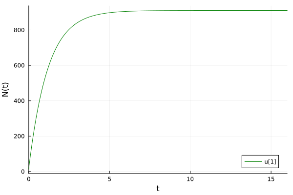
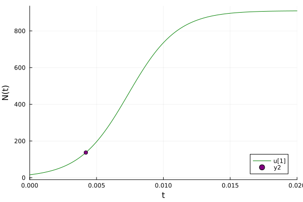
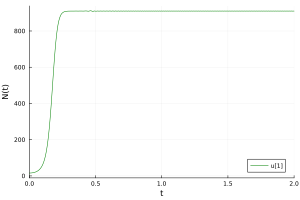

---
## Author
author:
  name: Сингх Ааруши
  degrees: DSc
  orcid: 0000-0002-0877-7063
  email: 1132215095@rudn.ru
  affiliation:
    - name: Российский университет дружбы народов
      country: Российская Федерация
      postal-code: 117198
      city: Москва
      address: ул. Миклухо-Маклая, д. 6

## Title
title: "Отчёта по лабораторной работе №7"
subtitle: "Эффективность рекламы "
license: "CC BY"
---

# Цель работы

Исследовать модель эффективности рекламы. 

# Задание

Построить график распространения рекламы, математическая модель которой описывается
следующим уравнением:

1. $\dfrac{dn}{dt} = (0.84+0.00002n(t))(N-n(t))$

2. $\dfrac{dn}{dt} = (0.000084+0.6n(t))(N-n(t))$

3. $\dfrac{dn}{dt} = (0.3t+0.3sin(t)n(t))(N-n(t))$

При этом объем аудитории $N = 910$, в начальный момент о товаре знает 16 человек. Для случая 2 определить в какой момент времени скорость распространения рекламы будет
иметь максимальное значение.

# Теоретическое введение

Пусть некая фирма начинает рекламировать новый товар. Необходимо, чтобы прибыль от будущих продаж покрывала издержки на дорогостоящую кампанию. Ясно, что вначале расходы могут превышать прибыль, поскольку лишь малая часть потенциальных покупателей будет информирована о новом товаре. Затем, при увеличении числа продаж, уже возможно рассчитывать на заметную прибыль, и, наконец, наступит момент, когда рынок насытится, и рекламировать товар далее станет бессмысленно.

Модель рекламной кампании основывается на следующих основных предположениях. Считается, что величина $\dfrac{dN}{dt}$ — скорость изменения со временем числа потребителей, узнавших о товаре и готовых купить его ($t$ — время, прошедшее с начала рекламной кампании, $N(t)$ – число уже информированных клиентов), — пропорциональна числу покупателей, еще не знающих о нем, т. е. величине $\alpha_1(t)(N_0 - N(t))$, где $N_0$ - общее число покупателей (емкость рынка),характеризует интенсивность рекламной кампании. Предполагается также, что узнавшие о товаре потребители распространяют полученную информацию среди неосведомленных, выступая как бы в роли дополнительных рекламных агентов фирмы. Их вклад равен величине $\alpha_2(t)N(t)(N_0-N(t))$, которая тем больше, чем больше число агентов. Величина $\alpha_2$ характеризует степень общения покупателей между собой [@stud].

В итоге получаем уравнение

$$\dfrac{dn}{dt} = (\alpha_1+\alpha_2 n(t))(N-n(t))$$


# Выполнение лабораторной работы

## Реализация на Julia

Подключаем нужные библиотеки для решения ДУ и для отрисовки графиков. Задаем само дифференциальное уравнение, а также начальные условия и параметры. Определяем `ODEProblem`.

```Julia
using DifferentialEquations, Plots;
f(n, p, t) = (p[1] + p[2]*n)*(p[3] - n)
p1 = [.000.84, 0002, 910]
p2 = [0.000084, 0.6, 910]
n_0 = 16
tspan1 = (0.0, 16.0)
tspan2 = (0.0, 0.02)
prob1 = ODEProblem(f, n_0, tspan1, p1)
prob2 = ODEProblem(f, n_0, tspan2, p2)
```

Когда задача определена, можем ее решить методом `solve()` и нарисовать график с помощью `plot()`.

```Julia
sol1 = solve(prob1, Tsit5(), saveat = 0.01)
plot(sol1, markersize =:15, c =:green, yaxis = "N(t)")
```
В результате получаем следующий график (рис. [-@fig:001]). Поскольку у нас $\alpha_1 >> \alpha_2$ мы получили модель Мальтуса. Видно, что когда значение покупателей становится 910 - рынок насытился, и дальше реклама бесполезна.

{#fig:001 width=70%}

Теперь решим ДУ для второго случая и построим график.

```Julia
sol2 = solve(prob2, Tsit5(), saveat = 0.0001)
plot(sol2, markersize =:15, c=:green, yaxis="N(t)")
```

Нам требуется найти момент времени, в который скорость распространения рекламы имеет максимальное значение. Первая производная - показатель скорости, поэтому нам просто надо найти максимальное значение $\dfrac{dn}{dt}$ на заданном промежутке времени. 

Для начала просто вычислим все производные на $t\in[0, 0.2]$ с шагом 0.0001, получим вектор значений. С помощью команды `maximum()` найдем максимальный элемент из этого вектора:

```Julia
dev = [sol2(i, Val{1}) for i in 0:0.0001:0.02]
maximum(dev)
```
Получим значение `124188.98536289045`.

Далее найдем индекс этого элемента в векторе `dev`.

```Julia
findall(x -> x == 124188.98536289045, dev)

1-element Vector{Int64}:
 43
```

Поскольку шаг и интервал времени, на котором мы вычисляли производные, равны шагу и интервалу времени, на котором мы решали ДУ, то индексы в векторе `dev` совпадают с индексами в векторе `sol.t` и `sol.u`. То есть мы можем найти момент времени и значение N(t), когда скорость распространения рекламы максимальна. Для наглядности отразим это на графике (рис. [-@fig:002]).

```Julia
 x = sol2.t[43]
 y = sol2.u[43]
 scatter!((x,y), c=:purple, leg=:bottomright)
```

Получаем график, который является логистической кривой, поскольку $\alpha_1 << \alpha_2$.

{#fig:002 width=70%}

Для случая 3 задание ДУ и его решение выглядит так:

```Julia
function f3(u,p,t)
    n = u
    dn = (0.3*t + 0.3*sin(t)*n)*(910 - n)
end
u_0 = 16
tspan = (0.0, 2)
prob = ODEProblem(f3, u_0, tspan)
sol = DifferentialEquations.solve(prob, Tsit5(), saveat = 0.001)
plot(sol, markersize =:15, c=:green, yaxis="N(t)")
```

В результате получаем следующий график (рис. [-@fig:003]).

{#fig:003 width=70%}

Можно заметить колебания скорости роста. Это показывает, что интенсивность рекламы в разные моменты времени меняется.

В результате модель демонстрирует, как реклама и общение между людьми влияют на распространение информации о товаре. 


# Выводы

В результате выполнения данной лабораторной работы была исследована модель эффективности рекламы.

# Список литературы{.unnumbered}

1. Исследование модели рекламной кампании [Электронный ресурс]. URL:https://studfile.net/preview/310591/.

::: {#refs}
:::
