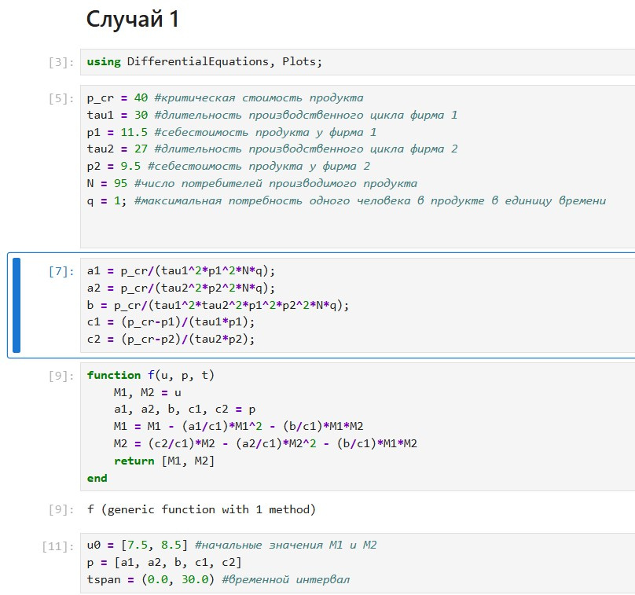
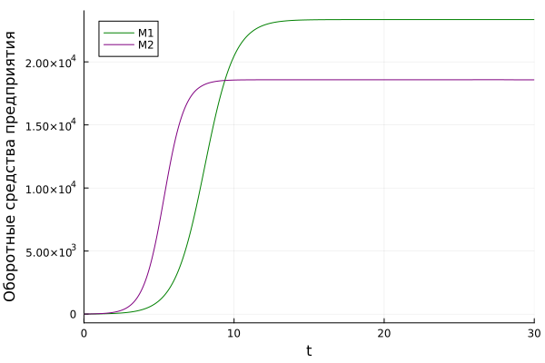
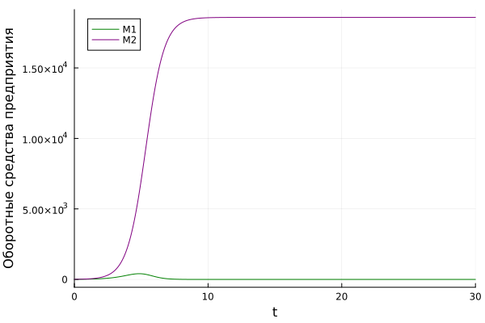

---
## Author
author:
  name: Сингх Ааруши
  degrees: DSc
  orcid: 0000-0002-0877-7063
  email: 1132215095@rudn.ru
  affiliation:
    - name: Российский университет дружбы народов
      country: Российская Федерация
      postal-code: 117198
      city: Москва
      address: ул. Миклухо-Маклая, д. 6
## Title
title:  Лабораторная работа 8
subtitle: Модель конкуренции двух фирм
license: CC BY
date: 2026-05-30
date-format: "2026-05-30" 
---

# Информация

## Докладчик

:::::::::::::: {.columns align=center}
::: {.column width="70%"}

  * Сингх Ааруши
  * Студентка
  * Российский университет дружбы народов им. П. Лумумбы
  * [113215095@rudn.ru](mailto:1132215095s@rudn.ru)
  * <https://github.com/Saarushi03/study_2025_2026_mathmod>

:::
::: {.column width="30%"}

:::
::::::::::::::

# Цель работы

Исследовать математическую модель конкуренции двух фирм.

# Задание

**Случай 1**

Рассмотрим две фирмы, производящие взаимозаменяемые товары
одинакового качества и находящиеся в одной рыночной нише. Считаем, что в рамках
нашей модели конкурентная борьба ведётся только рыночными методами. То есть,
конкуренты могут влиять на противника путем изменения параметров своего
производства: себестоимость, время цикла, но не могут прямо вмешиваться в
ситуацию на рынке («назначать» цену или влиять на потребителей каким-либо иным
способом.) Будем считать, что постоянные издержки пренебрежимо малы, и в
модели учитывать не будем. 

# Задание

**Случай 2**
Рассмотрим модель, когда, помимо экономического фактора
влияния (изменение себестоимости, производственного цикла, использование
кредита и т.п.), используются еще и социально-психологические факторы –
формирование общественного предпочтения одного товара другому, не зависимо от
их качества и цены. В этом случае взаимодействие двух фирм будет зависеть друг
от друга, соответственно коэффициент перед
M M1 2
будет отличаться. 

# Выполнение лабораторной работы

# Реализация на Julia

Подключаем нужные библиотеки для решения ДУ и для отрисовки графиков. Задаем само дифференциальное уравнение, а также начальные условия и параметры. 

# Реализация на Julia

**Случай 1**

Зададим функцию, описывающую систему уравнений для этого случая, Далее решаем систему ДУ, сначала определив проблему с помощью метода ODEProblem(), а затем решим с помощью solve() солвером Tsit5() с шагом 0.01. Нарисуем график с помощью plot().

{#fig:003 width=70%}

# Реализация на Julia

{#fig:004 width=70%}

# Реализация на Julia

**Случай 2**

{#fig:005 width=70%}

# Реализация на Julia

{#fig:006 width=70%}

# Выводы

В результате выполнения лабораторной работы была исследована модель конкуренции двух фирм.