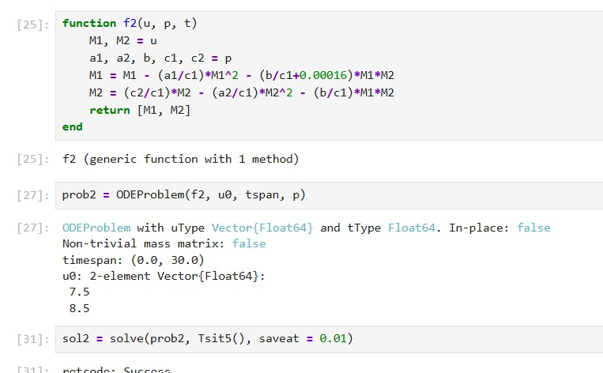

---
## Author
author:
  name: Сингх Ааруши
  degrees: DSc
  orcid: 0000-0002-0877-7063
  email: 1132215095@rudn.ru
  affiliation:
    - name: Российский университет дружбы народов
      country: Российская Федерация
      postal-code: 117198
      city: Москва
      address: ул. Миклухо-Маклая, д. 6

## Title
title: "Отчёта по лабораторной работе №8"
subtitle: "Конкуренции двух фирм"
license: "CC BY"
---

# Цель работы

Исследовать математическую модель конкуренции двух фирм.

# Задание

**Случай 1**

Рассмотрим две фирмы, производящие взаимозаменяемые товары
одинакового качества и находящиеся в одной рыночной нише. Считаем, что в рамках
нашей модели конкурентная борьба ведётся только рыночными методами. То есть,
конкуренты могут влиять на противника путем изменения параметров своего
производства: себестоимость, время цикла, но не могут прямо вмешиваться в
ситуацию на рынке («назначать» цену или влиять на потребителей каким-либо иным
способом.) Будем считать, что постоянные издержки пренебрежимо малы, и в
модели учитывать не будем.

**Случай 2**
Рассмотрим модель, когда, помимо экономического фактора
влияния (изменение себестоимости, производственного цикла, использование
кредита и т.п.), используются еще и социально-психологические факторы –
формирование общественного предпочтения одного товара другому, не зависимо от
их качества и цены. В этом случае взаимодействие двух фирм будет зависеть друг
от друга, соответственно коэффициент перед
M1 M2 будет отличаться.

# Теоретическое введение

Математическому моделированию процессов конкуренции и сотрудничества двух фирм на различных рынках посвящено довольно много научных работ, в основном использующих аппарат теории игр и статистических решений. В качестве примера можно привести работы таких исследователей, как Курно, Стакельберг, Бертран, Нэш, Парето [@model].

Следует отметить, что динамические дифференциальные модели уже давно и успешно используются для математического моделирования самых разнообразных по своей природе процессов. Достаточно упомянуть широко использующуюся в экологии модель «хищник-жертва» Вольтерра, математическую теорию развития эпидемий, модели боевых действий.

## Постановка задачи

Задача решалась в следующей постановке.

На рынке однородного товара присутствуют две основные фирмы, разделяющие его между собой, т.е. имеет место классическая дуополия.

Безусловно, это является весьма сильным предположением, однако оно вполне оправдано в тех случаях, когда доля продаж остальных конкурентов на рассматриваемом сегменте рынке пренебрежимо мала. Хорошим примером может служить отечественный рынок микропроцессоров, который по существу разделили между собой две фирмы: Intel и AMD.

Изменение объемов продаж конкурирующих фирм с течением времени описывается следующей системой дифференциальных уравнений:

Обозначения:
-  N  — число потребителей производимого продукта.
- tau — длительность производственного цикла.
- p — рыночная цена товара.
- tilde{p}  — себестоимость продукта, т.е. переменные издержки на единицу продукции.
-  q — максимальная потребность одного человека в продукте в единицу времени.
- theta = \frac{t}{c_1}  — безразмерное время.

# Выполнение лабораторной работы

## Реализация на Julia

Подключаем нужные библиотеки для решения ДУ и для отрисовки графиков. Задаем само дифференциальное уравнение, а также начальные условия и параметры. 

**Случай 1**

Зададим функцию, описывающую систему уравнений для этого случая, Далее решаем систему ДУ, сначала определив проблему с помощью метода ODEProblem(), а затем решим с помощью solve() солвером Tsit5() с шагом 0.01. Нарисуем график с помощью plot().

{#fig:003 width=70%}

В результате численного решения системы дифференциальных уравнений для конкурирующих фирм без учета постоянных издержек и с введенной нормировкой времени получаем следующий график изменения оборотных средств фирмы 1 и фирмы 2.
По графику видно, что рост оборотных средств обеих фирм происходит независимо. Обе фирмы достигают определенного устойчивого уровня, после чего объемы стабилизируются. 

В модели этот эффект отражается в одинаковом коэффициенте взаимодействия \( \frac{b}{c_1} \), стоящем перед смешанным членом \( M_1 M_2 \) в обоих уравнениях. Это означает симметричную конкуренцию без предпочтения одной из фирм.

Таким образом, каждая фирма захватывает свою долю рынка, которая не изменяется с течением времени, и они продолжают сосуществовать.

{#fig:004 width=70%}

**Случай 2**

{#fig:005 width=70%}

В случае добавления небольшого асимметричного социального влияния на одну из фирм (например, предпочтения потребителей), система динамики изменяется. Полученный график показан ниже.

{#fig:006 width=70%}

Как видно, фирма 1 (зелёная линия) сначала растет, но затем начинает снижать оборотные средства и в итоге банкротится. В то же время фирма 2 (фиолетовая линия) стабильно выходит на устойчивый максимум и полностью занимает рынок.

Это демонстрирует, как даже незначительное преимущество в восприятии потребителей может привести к полному вытеснению конкурента, несмотря на близкие стартовые условия.

# Выводы

В результате выполнения лабораторной работы была исследована модель конкуренции двух фирм.

# Список литературы{.unnumbered}

::: {#refs}
:::
